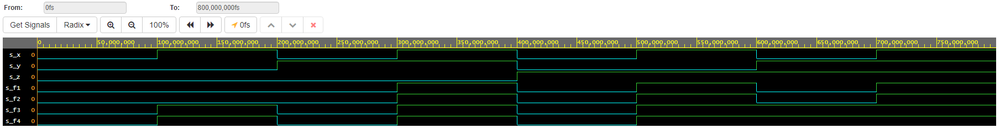

# 01-gates
[**My GitHub repository**](https://github.com/xhruby28/Digital-electronics-1)

## De Morgan's laws simulation
| **c** | **b** |**a** | **f(c,b,a)** |
| :-: | :-: | :-: | :-: |
| 0 | 0 | 0 | 1 |
| 0 | 0 | 1 | 1 |
| 0 | 1 | 0 | 0 |
| 0 | 1 | 1 | 0 |
| 1 | 0 | 0 | 0 |
| 1 | 0 | 1 | 1 |
| 1 | 1 | 0 | 0 |
| 1 | 1 | 1 | 0 |

#### VHDL Code

```vhdl
library ieee;               -- Standard library
use ieee.std_logic_1164.all;-- Package for data types and logic operations

------------------------------------------------------------------------
-- Entity declaration
------------------------------------------------------------------------
entity gates is
    port(
        a_i    : in  std_logic;          -- Data input
        b_i    : in  std_logic;          -- Data input
        c_i    : in  std_logic;		 -- Data input
        
	f_o     : out std_logic;         -- output function
        fnand_o : out std_logic;         -- NAND output function
        fnor_o  : out std_logic          -- NOR output function
    );
end entity gates;

------------------------------------------------------------------------
-- Architecture body
------------------------------------------------------------------------
architecture dataflow of gates is
begin
    f_o  <= ((not b_i) and a_i) or ((not c_i) and (not b_i));
    fnand_o <= not (not (not b_i and a_i) and not(not b_i and not c_i));
    fnor_o <= not (b_i or not a_i) or not (c_i or b_i);
end architecture dataflow;
```

#### Simulation screenshot


#### EDA Playground De Morgan's laws example 
[EDA Playground source code](https://www.edaplayground.com/x/7Xvg)


## Distributive laws simulation
*f1 = f2*
- *f1 = x · y + x · z*
- *f2 = x · (y + z)*

*f3 = f4*
- *f3 = (x + y) · (x + z)*
- *f4 = x + (y · z)*


| **z** | **y** |**x** | **f1** | **f2** | **f3** | **f4** |
| :-: | :-: | :-: | :-: | :-: | :-: | :-: |
| 0 | 0 | 0 | 0 | 0 | 0 | 0 |
| 0 | 0 | 1 | 0 | 0 | 1 | 1 |
| 0 | 1 | 0 | 0 | 0 | 0 | 0 |
| 0 | 1 | 1 | 1 | 1 | 1 | 1 |
| 1 | 0 | 0 | 0 | 0 | 0 | 0 |
| 1 | 0 | 1 | 1 | 1 | 1 | 1 |
| 1 | 1 | 0 | 0 | 0 | 1 | 1 |
| 1 | 1 | 1 | 1 | 1 | 1 | 1 |

#### VHDL Code

```vhdl
library ieee;               -- Standard library
use ieee.std_logic_1164.all;-- Package for data types and logic operations

------------------------------------------------------------------------
-- Entity declaration
------------------------------------------------------------------------

entity gates is
    port(
        x_i    : in  std_logic;
        y_i    : in  std_logic;
        z_i	: in  std_logic;
        
	f1_o   : out std_logic;
        f2_o   : out std_logic;
        f3_o   : out std_logic;
        f4_o   : out std_logic
    );
end entity gates;

------------------------------------------------------------------------
-- Architecture body
------------------------------------------------------------------------

architecture dataflow of gates is
begin
    f1_o  <= (x_i and y_i) or (x_i and z_i);
    f2_o  <= x_i and (y_i or z_i);
    f3_o  <= (x_i or y_i) and (x_i or z_i);
    f4_o  <= x_i or (y_i and z_i);
end architecture dataflow;
```

#### Simulation screenshot


#### EDA Playground Distributive laws example 
[EDA Playground source code](https://www.edaplayground.com/x/mh49)
