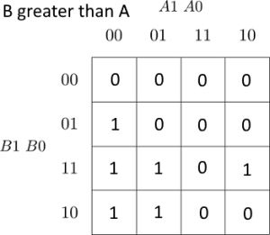
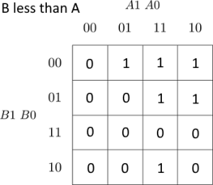
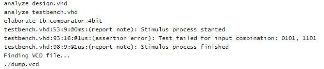

# 02-logic
## Preparation tasks

| **Dec. equivalent** | **B[1:0]** | **A[1:0]** | **B is greater than A** | **B equals A** | **B is less than A** |
| :-: | :-: | :-: | :-: | :-: | :-: |
| 0 | 0 0 | 0 0 | 0 | 1 | 0 |
| 1 | 0 0 | 0 1 | 0 | 0 | 1 |
| 2 | 0 0 | 1 0 | 0 | 0 | 1 |
| 3 | 0 0 | 1 1 | 0 | 0 | 1 |
| 4 | 0 1 | 0 0 | 1 | 0 | 0 |
| 5 | 0 1 | 0 1 | 0 | 1 | 0 |
| 6 | 0 1 | 1 0 | 0 | 0 | 1 |
| 7 | 0 1 | 1 1 | 0 | 0 | 1 |
| 8 | 1 0 | 0 0 | 1 | 0 | 0 |
| 9 | 1 0 | 0 1 | 1 | 0 | 0 |
| 10 | 1 0 | 1 0 | 0 | 1 | 0 |
| 11 | 1 0 | 1 1 | 0 | 0 | 1 |
| 12 | 1 1 | 0 0 | 1 | 0 | 0 |
| 13 | 1 1 | 0 1 | 1 | 0 | 0 |
| 14 | 1 1 | 1 0 | 1 | 0 | 0 |
| 15 | 1 1 | 1 1 | 0 | 1 | 0 |

## A 2-bit comparator

 &nbsp;  &nbsp;  &nbsp;  &nbsp; 
 &nbsp;  &nbsp;  &nbsp;  &nbsp; 


### My EDA playground example
- https://www.edaplayground.com/x/f8rK


## A 4-bit comparator

### VHDL architecture - design.vhd
```vhdl
    entity comparator_4bit is
        port(
            a_i           : in  std_logic_vector(4 - 1 downto 0);
            b_i           : in  std_logic_vector(4 - 1 downto 0);

            B_greater_A_o : out std_logic;
            B_equals_A_o  : out std_logic;
            B_less_A_o    : out std_logic      
        );
    end entity comparator_4bit;

    ------------------------------------------------------------------------
    -- Architecture body for 4-bit binary comparator
    ------------------------------------------------------------------------

    architecture Behavioral of comparator_4bit is
    begin

        B_greater_A_o   <= '1' when (b_i > a_i) else '0';
        B_equals_A_o    <= '1' when (b_i = a_i) else '0';
        B_less_A_o      <= '1' when (b_i < a_i) else '0';

    end architecture Behavioral;
```

### VHDL stimulus - testbench.vhd
```vhdl
    p_stimulus : process
    begin
        -- Report a note at the begining of stimulus process
        report "Stimulus process started" severity note;

        s_b <= "0000"; s_a <= "0000"; wait for 100 ns;
        assert ((s_B_greater_A = '0') and (s_B_equals_A = '1') and (s_B_less_A = '0'))
        report "Test failed for input combination: 0000, 0000" severity error;

	s_b <= "0101"; s_a <= "1001"; wait for 100 ns;
	assert ((s_B_greater_A = '0') and (s_B_equals_A = '0') and (s_B_less_A = '1'))
	report "Test failed for input combination: 0101, 1001" severity error;
        
        s_b <= "0111"; s_a <= "1000"; wait for 100 ns;
	assert ((s_B_greater_A = '0') and (s_B_equals_A = '0') and (s_B_less_A = '1'))
	report "Test failed for input combination: 0111, 1000" severity error;
        
        s_b <= "0101"; s_a <= "0001"; wait for 100 ns;
	assert ((s_B_greater_A = '1') and (s_B_equals_A = '0') and (s_B_less_A = '0'))
	report "Test failed for input combination: 0101, 0001" severity error;
        
        s_b <= "1111"; s_a <= "1111"; wait for 100 ns;
	assert ((s_B_greater_A = '0') and (s_B_equals_A = '1') and (s_B_less_A = '0'))
	report "Test failed for input combination: 1111, 1111" severity error;
        
        s_b <= "0001"; s_a <= "0001"; wait for 100 ns;
	assert ((s_B_greater_A = '0') and (s_B_equals_A = '1') and (s_B_less_A = '0'))
	report "Test failed for input combination: 0001, 0001" severity error;
        
        s_b <= "0101"; s_a <= "1001"; wait for 100 ns;
	assert ((s_B_greater_A = '0') and (s_B_equals_A = '0') and (s_B_less_A = '1'))
	report "Test failed for input combination: 0101, 1001" severity error;
        
        s_b <= "1111"; s_a <= "0000"; wait for 100 ns;
	assert ((s_B_greater_A = '1') and (s_B_equals_A = '0') and (s_B_less_A = '0'))
	report "Test failed for input combination: 0101, 1001" severity error;
        
        s_b <= "0111"; s_a <= "0001"; wait for 100 ns;
	assert ((s_B_greater_A = '1') and (s_B_equals_A = '0') and (s_B_less_A = '0'))
	report "Test failed for input combination: 0001, 1111" severity error;
        
        -- Intentional mistake
        s_b <= "0101"; s_a <= "1101"; wait for 100 ns;
	assert ((s_B_greater_A = '0') and (s_B_equals_A = '1') and (s_B_less_A = '0'))
	report "Test failed for input combination: 0101, 1101" severity error;


        -- Report a note at the end of stimulus process
        report "Stimulus process finished" severity note;
        wait;
    end process p_stimulus;
```

### Simulator console output
 

### 4-bit simulation EPWave
 


### My EDA playground example
- https://www.edaplayground.com/x/j9C7
