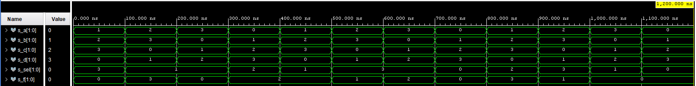

# 03-vivado
## 1.   Preparation tasks

### Connection table of 16 slide switches and 16 LEDs on Nexys A7 board

| **Switch** | **Connection** | **LED** | **Connection** | 
| :-: | :-: | :-: | :-: |
| SW0 | J15 | LED0 | H17 |
| SW1 | L16 | LED1 | K15 |
| SW2 | M13 | LED2 | J13 |
| SW3 | R15 | LED3 | N14 |
| SW4 | R17 | LED4 | R18 |
| SW5 | T18 | LED5 | V17 |
| SW6 | U18 | LED6 | U17 |
| SW7 | R13 | LED7 | U16 |
| SW8 | T8 | LED8 | V16 |
| SW9 | U8 | LED9 | T15 |
| SW10 | R16 | LED10 | U14 |
| SW11 | T13 | LED11 | T16 |
| SW12 | H6 | LED12 | V15 |
| SW13 | U12 | LED13 | V14 |
| SW14 | U11 | LED14 | V12 |
| SW15 | V10 | LED15 | V11 |

## 2. Two-bit wide 4-to-1 multiplexer

### VHDL architecture from source file mux_2bit_4to1.vhd
```vhdl

library ieee;
use ieee.std_logic_1164.all;

------------------------------------------------------------------------
-- Entity declaration for mux 2-bit 4 to 1
------------------------------------------------------------------------

entity mux_2bit_4to1 is
    port(
        a_i           : in  std_logic_vector(2 - 1 downto 0);
        b_i	          : in	std_logic_vector(2 - 1 downto 0);
        c_i           : in  std_logic_vector(2 - 1 downto 0);
        d_i	          : in	std_logic_vector(2 - 1 downto 0);
        sel_i	      : in	std_logic_vector(2 - 1 downto 0);

        f_o           : out std_logic_vector(2 - 1 downto 0)
    );
end entity mux_2bit_4to1;

------------------------------------------------------------------------
-- Architecture body for mux 2-bit 4 to 1
------------------------------------------------------------------------

architecture Behavioral of mux_2bit_4to1 is
begin

    f_o   <= a_i when (sel_i = "00") else
             b_i when (sel_i = "01") else
             c_i when (sel_i = "10") else
             d_i;
end architecture Behavioral;
```

### VHDL stimulus process from testbench file tb_mux_2bit_4to1.vhd
```vhdl

library ieee;
use ieee.std_logic_1164.all;

------------------------------------------------------------------------
-- Entity declaration for testbench
------------------------------------------------------------------------

entity tb_mux_2bit_4to1 is
    -- Entity of testbench is always empty
end entity tb_mux_2bit_4to1;

------------------------------------------------------------------------
-- Architecture body for testbench
------------------------------------------------------------------------

architecture testbench of tb_mux_2bit_4to1 is

    -- Local signals
    signal s_a       : std_logic_vector(2 - 1 downto 0);
    signal s_b       : std_logic_vector(2 - 1 downto 0);
    signal s_c       : std_logic_vector(2 - 1 downto 0);
    signal s_d       : std_logic_vector(2 - 1 downto 0);
    signal s_sel     : std_logic_vector(2 - 1 downto 0);
    
    signal s_f       : std_logic_vector(2 - 1 downto 0);

begin

    uut_mux_2bit_4to1 : entity work.mux_2bit_4to1
        port map(
            a_i           => s_a,
            b_i           => s_b,
            c_i           => s_c,
            d_i           => s_d,
            sel_i         => s_sel,
            
            f_o           => s_f
        );

    --------------------------------------------------------------------
    -- Data generation process
    --------------------------------------------------------------------
    
    p_stimulus : process
    begin
        -- Report a note at the begining of stimulus process
        report "Stimulus process started" severity note;

        s_d    <= "00"; s_c <= "11"; s_b <= "10"; s_a <= "01";
        s_sel  <= "11"; wait for 100 ns;
        
        s_d    <= "01"; s_c <= "00"; s_b <= "11"; s_a <= "10";
        s_sel  <= "01"; wait for 100 ns;
        
        s_d    <= "10"; s_c <= "01"; s_b <= "00"; s_a <= "11";
        s_sel  <= "01"; wait for 100 ns;
        
        s_d    <= "11"; s_c <= "10"; s_b <= "01"; s_a <= "00";
        s_sel  <= "10"; wait for 100 ns;
        
        s_d    <= "00"; s_c <= "11"; s_b <= "10"; s_a <= "01";
        s_sel  <= "01"; wait for 100 ns;
        
        s_d    <= "01"; s_c <= "00"; s_b <= "11"; s_a <= "10";
        s_sel  <= "11"; wait for 100 ns;
        
        s_d    <= "10"; s_c <= "01"; s_b <= "00"; s_a <= "11";
        s_sel  <= "11"; wait for 100 ns;
        
        s_d    <= "11"; s_c <= "10"; s_b <= "01"; s_a <= "00";
        s_sel  <= "00"; wait for 100 ns;
        
        s_d    <= "00"; s_c <= "11"; s_b <= "10"; s_a <= "01";
        s_sel  <= "10"; wait for 100 ns;
        
        s_d    <= "01"; s_c <= "00"; s_b <= "11"; s_a <= "10";
        s_sel  <= "11"; wait for 100 ns;
        
        s_d    <= "10"; s_c <= "01"; s_b <= "00"; s_a <= "11";
        s_sel  <= "01"; wait for 100 ns;
        
        s_d    <= "11"; s_c <= "10"; s_b <= "01"; s_a <= "00";
        s_sel  <= "00"; wait for 100 ns;
      
        report "Stimulus process finished" severity note;
        wait;
    end process p_stimulus;

end architecture testbench;
```

### Simulation screenshot



## 3. Vivado tutorial
### Project creation


### Adding source file


### Adding testbench file


### Running simulation


### Adding XDC constraints file