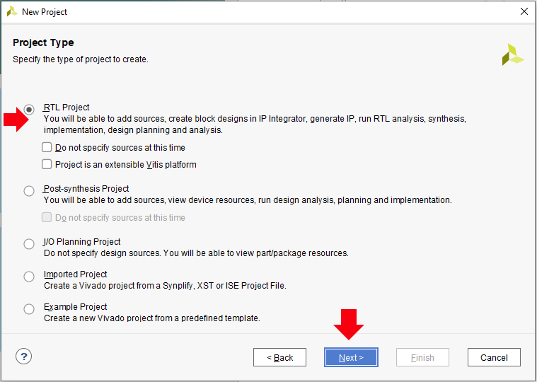
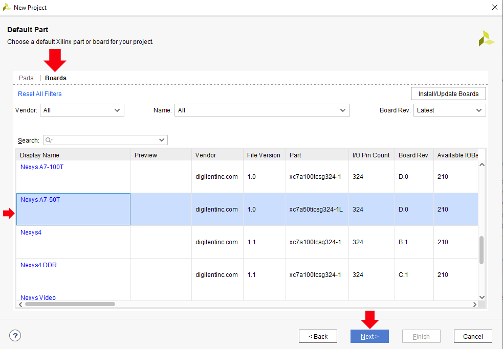
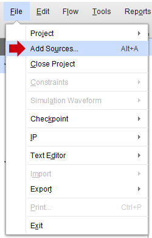
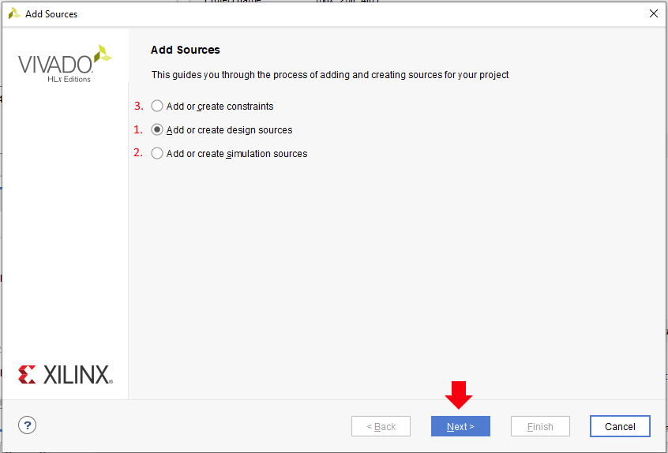
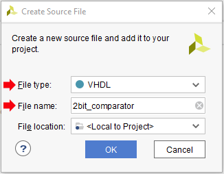
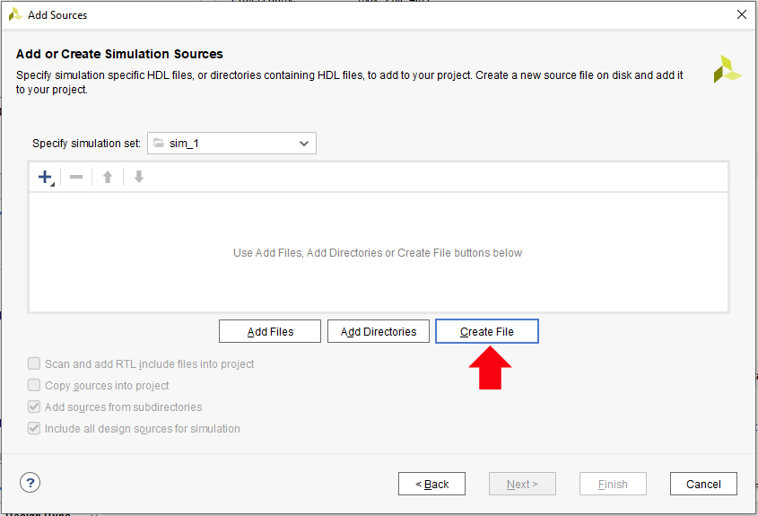
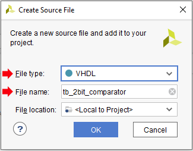
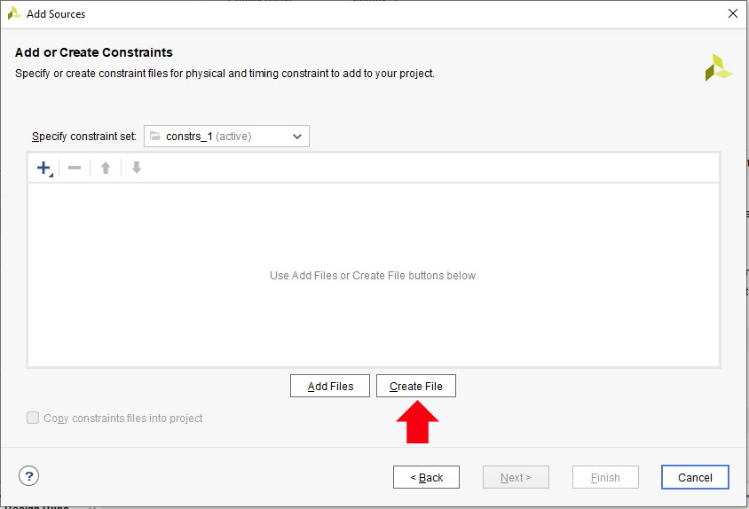

# 03-vivado

## Content
- [**1. Preparation tasks**](https://github.com/xhruby28/Digital-electronics-1/tree/main/Labs/03-vivado#1-preparation-tasks)
- [**2. Two-bit wide 4-to-1 multiplexer**](https://github.com/xhruby28/Digital-electronics-1/tree/main/Labs/03-vivado#2-two-bit-wide-4-to-1-multiplexer)
    - [VHDL architecture](https://github.com/xhruby28/Digital-electronics-1/tree/main/Labs/03-vivado#vhdl-architecture-from-source-file-mux_2bit_4to1vhd)
    - [VHDL stimulus process](https://github.com/xhruby28/Digital-electronics-1/tree/main/Labs/03-vivado#vhdl-stimulus-process-from-testbench-file-tb_mux_2bit_4to1vhd)
    - [Simulation screenshot](https://github.com/xhruby28/Digital-electronics-1/tree/main/Labs/03-vivado#simulation-screenshot)   
- [**3. Vivado tutorial**](https://github.com/xhruby28/Digital-electronics-1/tree/main/Labs/03-vivado#3-vivado-tutorial)
    - [Project creation](https://github.com/xhruby28/Digital-electronics-1/tree/main/Labs/03-vivado#project-creation)
    - [Adding sources](https://github.com/xhruby28/Digital-electronics-1/tree/main/Labs/03-vivado#adding-sources)
        - [1. Creating source file](https://github.com/xhruby28/Digital-electronics-1/tree/main/Labs/03-vivado#1-creating-source-file)
        - [2. Creating testbench file](https://github.com/xhruby28/Digital-electronics-1/tree/main/Labs/03-vivado#2-creating-testbench-file)
        - [3. Creating XDC constraints file](https://github.com/xhruby28/Digital-electronics-1/tree/main/Labs/03-vivado#3-creating-xdc-constraints-file)
    - [Running simulation](https://github.com/xhruby28/Digital-electronics-1/tree/main/Labs/03-vivado#running-simulation) 

## 1. Preparation tasks
[https://github.com/xhruby28/Digital-electronics-1/tree/main/Labs/03-vivado#content](Images/UP-Arrow.jpg)[  UP](https://github.com/xhruby28/Digital-electronics-1/tree/main/Labs/03-vivado#content)

### Connection table of 16 slide switches and 16 LEDs on Nexys A7 board

| **Switch** | **Connection** | **LED** | **Connection** | 
| :-: | :-: | :-: | :-: |
| SW0 | J15 | LED0 | H17 |
| SW1 | L16 | LED1 | K15 |
| SW2 | M13 | LED2 | J13 |
| SW3 | R15 | LED3 | N14 |
| SW4 | R17 | LED4 | R18 |
| SW5 | T18 | LED5 | V17 |
| SW6 | U18 | LED6 | U17 |
| SW7 | R13 | LED7 | U16 |
| SW8 | T8 | LED8 | V16 |
| SW9 | U8 | LED9 | T15 |
| SW10 | R16 | LED10 | U14 |
| SW11 | T13 | LED11 | T16 |
| SW12 | H6 | LED12 | V15 |
| SW13 | U12 | LED13 | V14 |
| SW14 | U11 | LED14 | V12 |
| SW15 | V10 | LED15 | V11 |

## 2. Two-bit wide 4-to-1 multiplexer

### VHDL architecture from source file mux_2bit_4to1.vhd
- [(Images/UP-Arrow.jpg)  UP](https://github.com/xhruby28/Digital-electronics-1/tree/main/Labs/03-vivado#content)

```vhdl

library ieee;
use ieee.std_logic_1164.all;

------------------------------------------------------------------------
-- Entity declaration for mux 2-bit 4 to 1
------------------------------------------------------------------------

entity mux_2bit_4to1 is
    port(
        a_i           : in  std_logic_vector(2 - 1 downto 0);
        b_i	          : in	std_logic_vector(2 - 1 downto 0);
        c_i           : in  std_logic_vector(2 - 1 downto 0);
        d_i	          : in	std_logic_vector(2 - 1 downto 0);
        sel_i	      : in	std_logic_vector(2 - 1 downto 0);

        f_o           : out std_logic_vector(2 - 1 downto 0)
    );
end entity mux_2bit_4to1;

------------------------------------------------------------------------
-- Architecture body for mux 2-bit 4 to 1
------------------------------------------------------------------------

architecture Behavioral of mux_2bit_4to1 is
begin

    f_o   <= a_i when (sel_i = "00") else
             b_i when (sel_i = "01") else
             c_i when (sel_i = "10") else
             d_i;
end architecture Behavioral;
```

### VHDL stimulus process from testbench file tb_mux_2bit_4to1.vhd
- [(Images/UP-Arrow.jpg)  UP](https://github.com/xhruby28/Digital-electronics-1/tree/main/Labs/03-vivado#content)

```vhdl

library ieee;
use ieee.std_logic_1164.all;

------------------------------------------------------------------------
-- Entity declaration for testbench
------------------------------------------------------------------------

entity tb_mux_2bit_4to1 is
    -- Entity of testbench is always empty
end entity tb_mux_2bit_4to1;

------------------------------------------------------------------------
-- Architecture body for testbench
------------------------------------------------------------------------

architecture testbench of tb_mux_2bit_4to1 is

    -- Local signals
    signal s_a       : std_logic_vector(2 - 1 downto 0);
    signal s_b       : std_logic_vector(2 - 1 downto 0);
    signal s_c       : std_logic_vector(2 - 1 downto 0);
    signal s_d       : std_logic_vector(2 - 1 downto 0);
    signal s_sel     : std_logic_vector(2 - 1 downto 0);
    
    signal s_f       : std_logic_vector(2 - 1 downto 0);

begin

    uut_mux_2bit_4to1 : entity work.mux_2bit_4to1
        port map(
            a_i           => s_a,
            b_i           => s_b,
            c_i           => s_c,
            d_i           => s_d,
            sel_i         => s_sel,
            
            f_o           => s_f
        );

    --------------------------------------------------------------------
    -- Data generation process
    --------------------------------------------------------------------
    
    p_stimulus : process
    begin
        -- Report a note at the begining of stimulus process
        report "Stimulus process started" severity note;

        s_d    <= "00"; s_c <= "11"; s_b <= "10"; s_a <= "01";
        s_sel  <= "11"; wait for 100 ns;
        
        s_d    <= "01"; s_c <= "00"; s_b <= "11"; s_a <= "10";
        s_sel  <= "01"; wait for 100 ns;
        
        s_d    <= "10"; s_c <= "01"; s_b <= "00"; s_a <= "11";
        s_sel  <= "01"; wait for 100 ns;
        
        s_d    <= "11"; s_c <= "10"; s_b <= "01"; s_a <= "00";
        s_sel  <= "10"; wait for 100 ns;
        
        s_d    <= "00"; s_c <= "11"; s_b <= "10"; s_a <= "01";
        s_sel  <= "01"; wait for 100 ns;
        
        s_d    <= "01"; s_c <= "00"; s_b <= "11"; s_a <= "10";
        s_sel  <= "11"; wait for 100 ns;
        
        s_d    <= "10"; s_c <= "01"; s_b <= "00"; s_a <= "11";
        s_sel  <= "11"; wait for 100 ns;
        
        s_d    <= "11"; s_c <= "10"; s_b <= "01"; s_a <= "00";
        s_sel  <= "00"; wait for 100 ns;
        
        s_d    <= "00"; s_c <= "11"; s_b <= "10"; s_a <= "01";
        s_sel  <= "10"; wait for 100 ns;
        
        s_d    <= "01"; s_c <= "00"; s_b <= "11"; s_a <= "10";
        s_sel  <= "11"; wait for 100 ns;
        
        s_d    <= "10"; s_c <= "01"; s_b <= "00"; s_a <= "11";
        s_sel  <= "01"; wait for 100 ns;
        
        s_d    <= "11"; s_c <= "10"; s_b <= "01"; s_a <= "00";
        s_sel  <= "00"; wait for 100 ns;
      
        report "Stimulus process finished" severity note;
        wait;
    end process p_stimulus;

end architecture testbench;
```

### Simulation screenshot
- [(Images/UP-Arrow.jpg)  UP](https://github.com/xhruby28/Digital-electronics-1/tree/main/Labs/03-vivado#content)


## 3. Vivado tutorial
### Project creation
- [(Images/UP-Arrow.jpg)  UP](https://github.com/xhruby28/Digital-electronics-1/tree/main/Labs/03-vivado#content)
Open program Vivado. There is a **File** in the top bar: **File** -> **Project** -> **New...** 


**New...** will open new window. There press **Next >**. Then name the project and select folder, where will be located.


After that press **Next >** and select **RTL Project**  



After pressing **Next >**, you can skip **Add Sources** and **Add Constraints**, because you can create them later. 
Now, you can choose **Default Part**. Select **Boards**, find and select board Nexys A7-50T. After that you can finsih creating project.  



### Adding sources
- [(Images/UP-Arrow.jpg)  UP](https://github.com/xhruby28/Digital-electronics-1/tree/main/Labs/03-vivado#content)

After creating project, you can add sources. They have similar creation procedure.
In the top bar select **File** -> **Add sources...**



Now select what you want to add or create.

 

If you want to add file, it's simple. You need to find or download file, select what type of file it is (Constraints/Design sources/Simulation sources) 
and click on **Add Files** and select destination of the file.
If you want to create sources, testbench XDC constraints file, follow steps below. 

#### 1. Creating source file
- [(Images/UP-Arrow.jpg)  UP](https://github.com/xhruby28/Digital-electronics-1/tree/main/Labs/03-vivado#content)

Select **Add or create design sources** -> **Next >**. 
After that select **Create File**


Select **File type** to **VHDL** and name design after the project name and press **OK**.
 
 

Now if you are done, press **Finish**.

#### 2. Creating testbench file
[[](Images/UP-Arrow.jpg)  UP](https://github.com/xhruby28/Digital-electronics-1/tree/main/Labs/03-vivado#content)

Select **Add or create simulation sources** -> **Next >**.                                   
After that select **Create File**



Select **File type** to **VHDL** and name testbench *tb_design_name* and press **OK**. (For example if you have design name 2bit_comparator, name testbench tb_2bit_comparator)

 
 
Now if you are done, press **Finish**.

#### 3. Creating XDC constraints file
- [(Images/UP-Arrow.jpg)  UP](https://github.com/xhruby28/Digital-electronics-1/tree/main/Labs/03-vivado#content)

You can find XDC constraits [**here**](https://github.com/Digilent/digilent-xdc) and find your board. You can copy code and create constraints file or download and import the file.
If you want to create constraints file follow steps below.

Select **Add or create constraints** -> **Next >**.                                   
After that select **Create File**



Name constraints file, it's better to name the file according to the board you are using (For example if you are using board Nexys A7 50T, name the file Nexys-A7-50T.xdc).


Now if you are done, press **Finish**.

### Running simulation
- [(Images/UP-Arrow.jpg)  UP](https://github.com/xhruby28/Digital-electronics-1/tree/main/Labs/03-vivado#content)

After you are done with the coding and want to run the simulation you can use **Flow Navigator** below the menu bar on the left side.
Find **Simulation** here, click on **Run Simulation** and select **Run Behavioral Simulation**.


After a while you will see something like this screenshot.


If you want to see full simulation press **F3** or click on **Run All**(**1**). 
Center Simulation screen only on the graphs pressing by **Zoom Fit**(**2**).
You can add another marker with **Add Marker**(**3**).
