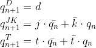
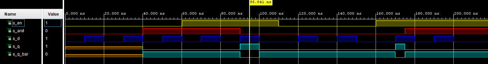
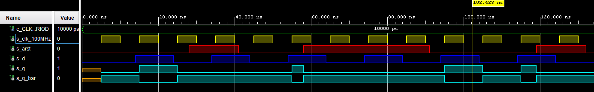
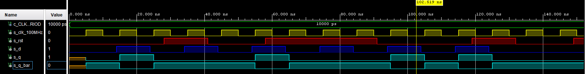
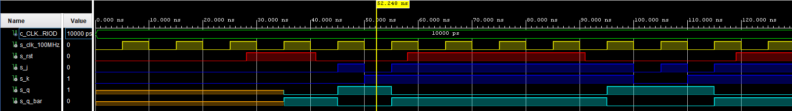
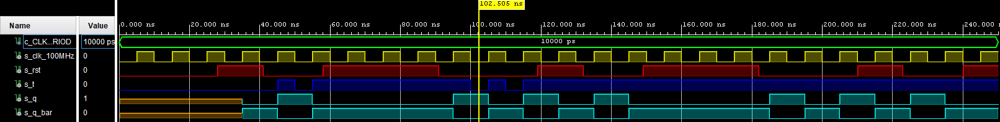
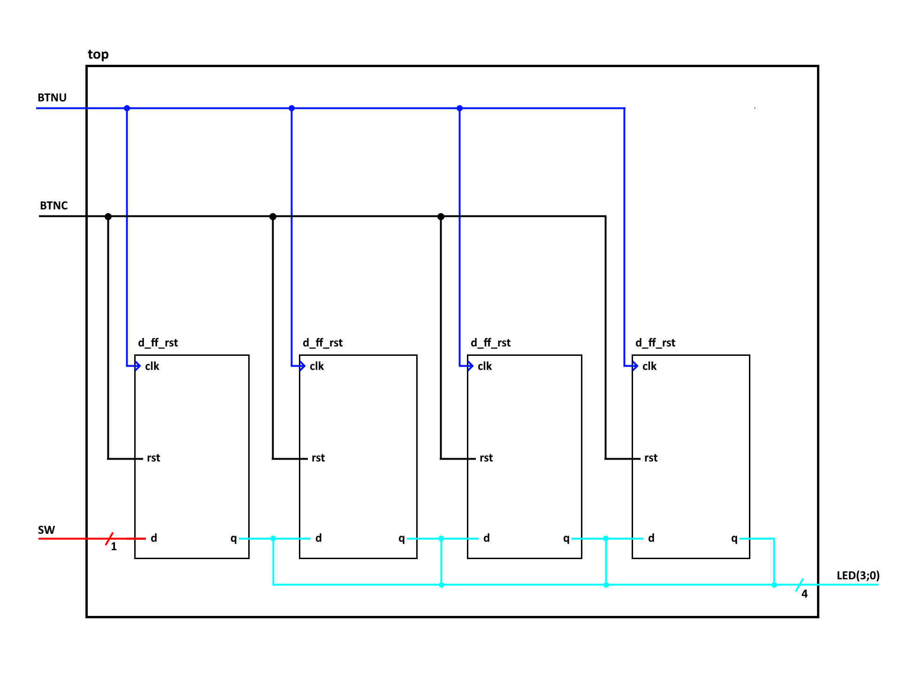

# 06-ffs

## Content
- [**1. Preparation tasks**]()
    - [Characteristic equations]() 
    - [Tables for D, JK, T flip-flops]()
- [**2. D latch**]() 
    - [VHDL code of process `p_d_latch`]()
    - [VHDL reset and stimulus processes from the testbench `tb_d_latch.vhd`]()
    - [Simulation screenshot]()  
- [**3. Flip-flops ]()
    - [D type flip-flop with an async reset]()
        - [VHDL code of process `p_d_ff_arst`]()
        - [VHDL clock, reset and stimulus processes from the testbench `tb_d_ff_arst.vhd`]()
        - [Simulation screenshot of D type flip-flop with an async reset]() 
    - [VHDL code of process `p_mux`]()
        - [VHDL code of process `p_d_ff_rst`]()
        - [VHDL clock, reset and stimulus processes from the testbench `tb_d_ff_rst.vhd`]()
        - [Simulation screenshot of D type flip-flop with an sync reset]() 
    - [VHDL testbench file `tb_driver_7seg_4digits`]()
        - [VHDL code of process `p_jk_ff_rst`]()
        - [VHDL clock, reset and stimulus processes from the testbench `tb_jk_ff_rst.vhd`]()
        - [Simulation screenshot of JK type flip-flop with a sync reset]() 
    - [Simulation screenshot]() 
        - [VHDL code of process `p_t_ff_rst`]()
        - [VHDL clock, reset and stimulus processes from the testbench `tb_t_ff_rst.vhd`]()
        - [Simulation screenshot of T type flip-flop with a sync reset]() 
- [**4. Shift register**]()
    - [Shift register schematic]()


## 1. Preparation tasks

### Characteristic equations [UP](Un_das_nope)



### Tables for D, JK, T flip-flops [UP](Un_das_nope)

| **clk** | **d** | **q(n)** | **q(n+1)** | **Comments** |
| :-: | :-: | :-: | :-: | :-- |
|  | 0 | 0 | 0 | Sampled and stored |
|  | 0 | 1 | 0 | Sampled and stored |
|  | 1 | 0 | 1 | Sampled and stored |
|  | 1 | 1 | 1 | Sampled and stored |

| **clk** | **j** | **k** | **q(n)** | **q(n+1)** | **Comments** |
| :-: | :-: | :-: | :-: | :-: | :-- |
|  | 0 | 0 | 0 | 0 | No change |
|  | 0 | 0 | 1 | 1 | No change |
|  | 0 | 1 | 0 | 0 | Reset |
|  | 0 | 1 | 1 | 0 | Reset |
|  | 1 | 0 | 0 | 1 | Set |
|  | 1 | 0 | 1 | 1 | Set |
|  | 1 | 1 | 0 | 1 | Toggle (=invert) |
|  | 1 | 1 | 1 | 0 | Toggle (=invert) |

| **clk** | **t** | **q(n)** | **q(n+1)** | **Comments** |
| :-: | :-: | :-: | :-: | :-- |
|  | 0 | 0 | 0 | No change |
|  | 0 | 1 | 1 | No change |
|  | 1 | 0 | 1 | Toggle (=invert) |
|  | 1 | 1 | 0 | Toggle (=invert) |
   
## 2. D latch

### VHDL code of process `p_d_latch` [UP](Un_das_nope)

```vhdl
    p_d_latch : process(d, arst, en)
    begin
        if (arst = '1') then
            q       <= '0';
            q_bar   <= '1';
            
        elsif (en = '1') then
            q       <= d;
            q_bar   <= not d;
            
        end if;       
    end process p_d_latch;
```

### VHDL reset and stimulus processes from the testbench `tb_d_latch.vhd` [UP](Un_das_nope)

```vhdl
    --------------------------------------------------------------------
    -- Reset generation process
    --------------------------------------------------------------------
     p_reset_gen : process
     begin
         s_arst <= '0';
         wait for 40 ns;
         
         -- Reset activated
         s_arst <= '1';
         wait for 50 ns;

         --Reset deactivated
         s_arst <= '0';
         wait for 85 ns;
         
         s_arst <= '1';
         wait;
     end process p_reset_gen;

    --------------------------------------------------------------------
    -- Data generation process
    --------------------------------------------------------------------
    p_stimulus : process
    begin
        report "Stimulus process started" severity note;
        
        s_d  <= '0';
        s_en <= '0';
        
        --d sekv (en <= '0')
        wait for 10 ns;
        s_d  <= '1';
        wait for 10 ns;
        s_d  <= '0';
        wait for 5 ns;
        
        assert ((s_arst = '0') and (s_en = '0') and (s_q = 'U') and (s_q_bar = 'U'))
        report "Test failed for reset low, en low when s_d = '0'" severity error;
        
        wait for 5 ns;
        s_d  <= '1';
        wait for 10 ns;
        s_d  <= '0';
        wait for 10 ns;
        s_d  <= '1';
        wait for 5 ns;
        
        assert ((s_arst = '1') and (s_en = '0') and (s_q = '0') and (s_q_bar = '1'))
        report "Test failed for reset high, en low when s_d = '1'" severity error;
        
        wait for 5 ns; 
        
        s_d  <= '0';
        s_en <= '1';
        
        --d sekv (en <= '1')
        wait for 10 ns;
        s_d  <= '1';
        wait for 10 ns;
        s_d  <= '0';
        wait for 10 ns;
        s_d  <= '1';
        wait for 10 ns;
        s_d  <= '0';
        wait for 5 ns;
        
        assert ((s_arst = '0') and (s_en = '1') and (s_q = '0') and (s_q_bar = '1'))
        report "Test failed for reset low, en high when s_d = '0'" severity error;
        
        wait for 5 ns;    
        
        s_d  <= '0';
        s_en <= '0';
        
        --d sekv (en <= '0')
        wait for 10 ns;
        s_d  <= '1';
        wait for 5 ns;
        
        assert ((s_arst = '0') and (s_en = '0') and (s_q = '0') and (s_q_bar = '1'))
        report "Test failed for reset low, en low when s_d = '1'" severity error;
        
        wait for 5 ns;
        s_d  <= '0';
        wait for 10 ns;
        s_d  <= '1';
        wait for 10 ns;
        s_d  <= '0';
        wait for 10 ns;
        
        s_d  <= '0';
        s_en <= '1';
        
        --d sekv (en <= '1')
        wait for 5 ns;
        
        assert ((s_arst = '0') and (s_en = '1') and (s_q = '0') and (s_q_bar = '1'))
        report "Test failed for reset low, en high when s_d = '0'" severity error;
        
        wait for 5 ns;
        s_d  <= '1';
        wait for 6 ns;
        
        assert ((s_arst = '1') and (s_en = '1') and (s_q = '0') and (s_q_bar = '1'))
        report "Test failed for reset high, en high when s_d = '1'" severity error;
        
        wait for 4 ns;
        s_d  <= '0';
        wait for 10 ns;
        s_d  <= '1';
        wait for 10 ns;
        s_d  <= '0';
        wait for 10 ns;
        
        report "Stimulus process finished" severity note;
        wait;
    end process p_stimulus;
```

### Simulation screenshot [UP](Un_das_nope)

 

## 3. Flip-flops  

## - D type flip-flop with an async reset

### VHDL code of process `p_d_ff_arst` [UP](Un_das_nope)

```vhdl
    p_d_ff_arst : process (clk, arst)
    begin
        if (arst = '1') then
            q     <= '0';
            q_bar <= '1';
        
        elsif rising_edge(clk) then
            q     <= d;
            q_bar <= not d;
        
        end if;
    end process p_d_ff_arst;
```

### VHDL clock, reset and stimulus processes from the testbench `tb_d_ff_arst.vhd` [UP](Un_das_nope)

```vhdl
    -------------------------------------------------------------------
    -- Clock generation process
    --------------------------------------------------------------------
    p_clk_gen : process
    begin
        while now < 40 ms loop 
            s_clk_100MHz <= '0';
            wait for c_CLK_100MHZ_PERIOD / 2;
            s_clk_100MHz <= '1';
            wait for c_CLK_100MHZ_PERIOD / 2;
        end loop;
        wait;
    end process p_clk_gen;

    --------------------------------------------------------------------
    -- Reset generation process
    --------------------------------------------------------------------
    p_reset_gen : process
    begin
        s_arst <= '0';
        wait for 28 ns;
        
        -- Reset activated
        s_arst <= '1';
        wait for 13 ns;

        s_arst <= '0';
        wait for 17 ns;
        
        s_arst <= '1';
        wait for 33 ns;
        
        s_arst <= '1';
        
        
    end process p_reset_gen;
    --------------------------------------------------------------------
    -- Data generation process
    --------------------------------------------------------------------
    p_stimulus : process
    begin
        report "Stimulus process started" severity note;

        s_d <= '0';
        
        wait for 14 ns;
        s_d <= '1';
        wait for 5 ns;
        
        assert ((s_arst = '0') and (s_q = '1') and (s_q_bar = '0'))
        report "Test failed for reset low, after clk rising when s_d = '1'" severity error;
        
        wait for 5 ns; 
        s_d <= '0';
    
        wait for 5 ns;
        
        assert ((s_arst = '1') and (s_q = '0') and (s_q_bar = '1'))
        report "Test failed for reset high, after clk rising when s_d = '0'" severity error;
        
        wait for 5 ns; 
        
        s_d <= '1';
        wait for 10 ns;
        s_d <= '0';
        wait for 10 ns;
        s_d <= '1';
        wait for 10 ns;
        s_d <= '0';
        
        wait for 10 ns;
        s_d <= '1';
        wait for 10 ns;
        s_d <= '0';
        wait for 10 ns;
        s_d <= '1';
        wait for 8 ns;
        
        assert ((s_arst = '0') and (s_q = '1') and (s_q_bar = '0'))
        report "Test failed for reset high, before clk rising when s_d = '1'" severity error;
        
        wait for 2 ns;
        s_d <= '0';
        wait for 10 ns;
        s_d <= '1';
        wait for 10 ns;
        s_d <= '0';

        report "Stimulus process finished" severity note;
        wait;
    end process p_stimulus;
```

### Simulation screenshot of D type flip-flop with an async reset [UP](Un_das_nope) 

 

## - D type flip-flop with a sync reset   

### VHDL code of process `p_d_ff_rst` [UP](Un_das_nope)

```vhdl
    p_d_ff_rst : process (clk, rst)
    begin
        if rising_edge(clk) then
            if (rst = '1') then
                q     <= '0';
                q_bar <= '1';
            
            else
                q     <= d;
                q_bar <= not d;
            
            end if;
        end if;
    end process p_d_ff_rst
```

### VHDL clock, reset and stimulus processes from the testbench `tb_d_ff_rst.vhd` [UP](Un_das_nope)

```vhdl
    -------------------------------------------------------------------
    -- Clock generation process
    --------------------------------------------------------------------
    p_clk_gen : process
    begin
        while now < 40 ms loop
            s_clk_100MHz <= '0';
            wait for c_CLK_100MHZ_PERIOD / 2;
            s_clk_100MHz <= '1';
            wait for c_CLK_100MHZ_PERIOD / 2;
        end loop;
        wait;
    end process p_clk_gen;

    --------------------------------------------------------------------
    -- Reset generation process
    --------------------------------------------------------------------
    p_reset_gen : process
    begin
        s_rst <= '0';
        wait for 28 ns;
        
        -- Reset activated
        s_rst <= '1';
        wait for 13 ns;

        s_rst <= '0';
        wait for 17 ns;
        
        s_rst <= '1';
        wait for 33 ns;
        
        s_rst <= '1';
        
        
    end process p_reset_gen;
    --------------------------------------------------------------------
    -- Data generation process
    --------------------------------------------------------------------
    p_stimulus : process
    begin
        report "Stimulus process started" severity note;

        s_d <= '0';
        
        wait for 14 ns;
        s_d <= '1';
        wait for 5 ns;
        
        assert ((s_rst = '0') and (s_q = '1') and (s_q_bar = '0'))
        report "Test failed for reset low, after clk rising when s_d = '1'" severity error;
        
        wait for 5 ns; 
        s_d <= '0';
    
        wait for 5 ns;
        
        assert ((s_rst = '1') and (s_q = '0') and (s_q_bar = '1'))
        report "Test failed for reset high, after clk rising when s_d = '0'" severity error;
        
        wait for 5 ns; 
        
        s_d <= '1';
        wait for 10 ns;
        s_d <= '0';
        wait for 10 ns;
        s_d <= '1';
        wait for 10 ns;
        s_d <= '0';
        
        wait for 10 ns;
        s_d <= '1';
        wait for 10 ns;
        s_d <= '0';
        wait for 10 ns;
        s_d <= '1';
        wait for 8 ns;
        
        assert ((s_rst = '0') and (s_q = '1') and (s_q_bar = '0'))
        report "Test failed for reset high, before clk rising when s_d = '1'" severity error;
        
        wait for 2 ns;
        s_d <= '0';
        wait for 10 ns;
        s_d <= '1';
        wait for 10 ns;
        s_d <= '0';

        report "Stimulus process finished" severity note;
        wait;
    end process p_stimulus;
```

### Simulation screenshot of D type flip-flop with a sync reset [UP](Un_das_nope)

 

## - JK type flip-flop with a sync reset 

### VHDL code of process `p_jk_ff_rst` [UP](Un_das_nope)

```vhdl
    p_jk_ff_rst : process (clk)
    begin
        if rising_edge(clk) then
            if (rst = '1') then
                s_q <= '0';
            else 
                if (j = '0' and k ='0') then
                    s_q <= s_q;
                    
                elsif (j = '0' and k ='1') then
                    s_q <= '0';
                    
                elsif (j = '1' and k ='0') then
                    s_q <= '1';
                    
                elsif (j = '1' and k ='1') then
                    s_q <= not s_q;
                    
                end if;
                
            end if;
            
        end if;
    end process p_jk_ff_rst;

    q     <= s_q;
    q_bar <= not s_q;
```

### VHDL clock, reset and stimulus processes from the testbench `tb_jk_ff_rst.vhd` [UP](Un_das_nope)

```vhdl
-------------------------------------------------------------------
    -- Clock generation process
    --------------------------------------------------------------------
    p_clk_gen : process
    begin
        while now < 40 ms loop
            s_clk_100MHz <= '0';
            wait for c_CLK_100MHZ_PERIOD / 2;
            s_clk_100MHz <= '1';
            wait for c_CLK_100MHZ_PERIOD / 2;
        end loop;
        wait;
    end process p_clk_gen;

    --------------------------------------------------------------------
    -- Reset generation process
    --------------------------------------------------------------------
    p_reset_gen : process
    begin
        s_rst<= '0';
        wait for 28 ns;
        
        -- Reset activated
        s_rst <= '1';
        wait for 13 ns;

        s_rst <= '0';
        wait for 17 ns;
        
        s_rst <= '1';
        wait for 33 ns;
        
        s_rst <= '1';
        
        
    end process p_reset_gen;
    --------------------------------------------------------------------
    -- Data generation process
    --------------------------------------------------------------------
    p_stimulus : process
    begin
        report "Stimulus process started" severity note;

        s_j <= '0';
        s_k <= '0';
        
        wait for 40 ns;
        s_j <= '0';
        s_k <= '0';
        wait for 2 ns;
        
        assert ((s_rst = '0') and (s_j = '0') and (s_k = '0') and (s_q = '0') and (s_q_bar = '1'))
        report "Test of type 'no change' failed for reset low, after clk rising when s_j = '0' and s_k = '0'" severity error;
        
        wait for 3 ns;
        s_j <= '1';
        s_k <= '0';
        wait for 2 ns;
        
        assert ((s_rst = '0') and (s_j = '1') and (s_k = '0') and (s_q = '1') and (s_q_bar = '0'))
        report "Test of type 'set' failed for reset low, after clk rising when s_j = '1' and s_k = '0'" severity error;
        
        wait for 3 ns;
        s_j <= '0';
        s_k <= '1';
        wait for 2 ns;
        
        assert ((s_rst = '0') and (s_j = '0') and (s_k = '1') and (s_q = '1') and (s_q_bar = '0'))
        report "Test of type 'reset' failed for reset low, before clk rising when s_j = '0' and s_k = '1'" severity error;
        
        wait for 3 ns;
        s_j <= '1';
        s_k <= '1';
        wait for 2 ns;
        
        assert ((s_rst = '0') and (s_j = '1') and (s_k = '1') and (s_q = '0') and (s_q_bar = '1'))
        report "Test of type 'toggle' failed for reset low, after clk rising when s_j = '1' and s_k = '1'" severity error;
        
        wait for 3 ns;
        
        wait for 40 ns;
        s_j <= '0';
        s_k <= '0';
        wait for 5 ns;
        s_j <= '1';
        s_k <= '0';
        wait for 5 ns;
        s_j <= '0';
        s_k <= '1';
        wait for 5 ns;
        s_j <= '1';
        s_k <= '1';

        report "Stimulus process finished" severity note;
        wait;
    end process p_stimulus;
```

### Simulation screenshot of JK type flip-flop with a sync reset [UP](Un_das_nope) 

 

## - T type flip-flop with a sync reset  

### VHDL code of process `p_t_ff_rst` [UP](Un_das_nope) 

```vhdl
    p_t_ff_rst : process (clk)
    begin
        if rising_edge(clk) then
            if (rst = '1') then
                s_q <= '0';
                
            elsif (t = '1') then
                s_q <= not s_q;
                
            end if;
            
        end if;
    end process p_t_ff_rst;

    q     <= s_q;
    q_bar <= not s_q;
```

### VHDL clock, reset and stimulus processes from the testbench `tb_t_ff_rst.vhd` [UP](Un_das_nope) 

```vhdl
    -------------------------------------------------------------------
    -- Clock generation process
    --------------------------------------------------------------------
    p_clk_gen : process
    begin
        while now < 40 ms loop
            s_clk_100MHz <= '0';
            wait for c_CLK_100MHZ_PERIOD / 2;
            s_clk_100MHz <= '1';
            wait for c_CLK_100MHZ_PERIOD / 2;
        end loop;
        wait;
    end process p_clk_gen;

    --------------------------------------------------------------------
    -- Reset generation process
    --------------------------------------------------------------------
    p_reset_gen : process
    begin
        s_rst<= '0';
        wait for 28 ns;
        
        -- Reset activated
        s_rst <= '1';
        wait for 13 ns;

        s_rst <= '0';
        wait for 17 ns;
        
        s_rst <= '1';
        wait for 33 ns;
        
        s_rst <= '1';
        
    end process p_reset_gen;
    
    --------------------------------------------------------------------
    -- Data generation process
    --------------------------------------------------------------------
    p_stimulus : process
    begin
        report "Stimulus process started" severity note;   
        
        s_t <= '0';
        
        wait for 42 ns;
        
        assert ((s_rst = '0') and (s_t = '0') and (s_q = '0') and (s_q_bar = '1'))
        report "Test of type 'no change' failed for reset low, after clk rising when s_t = '0'" severity error;
        
        wait for 3 ns;
        s_t <= '1';
        wait for 2 ns;
        
        assert ((s_rst = '0') and (s_t = '1') and (s_q = '1') and (s_q_bar = '0'))
        report "Test of type 'toggle' failed for reset low, after clk rising when s_t = '1'" severity error;
        
        wait for 3 ns;
        s_t <= '0';
        wait for 2 ns;
        
        assert ((s_rst = '0') and (s_t = '0') and (s_q = '1') and (s_q_bar = '0'))
        report "Test of type 'no change' failed for reset low, before clk rising when s_t = '0'" severity error;
        
        wait for 3 ns;
        s_t <= '1';
        wait for 3 ns;
        
        assert ((s_rst = '0') and (s_t = '1') and (s_q = '0') and (s_q_bar = '1'))
        report "Test of type 'toggle' failed for reset low, after clk rising when s_t = '1'" severity error;
        
        wait for 2 ns;
        
        wait for 40 ns;
        s_t <= '0';
        wait for 5 ns;
        s_t <= '1';
        wait for 5 ns;
        s_t <= '0';
        wait for 5 ns;
        s_t <= '1';
        
        report "Stimulus process finished" severity note;
        wait;
    end process p_stimulus;
```

### Simulation screenshot of T type flip-flop with a sync reset [UP](Un_das_nope)

 

## 4. Shift register 

### Shift register schematic [UP](Un_das_nope)

 