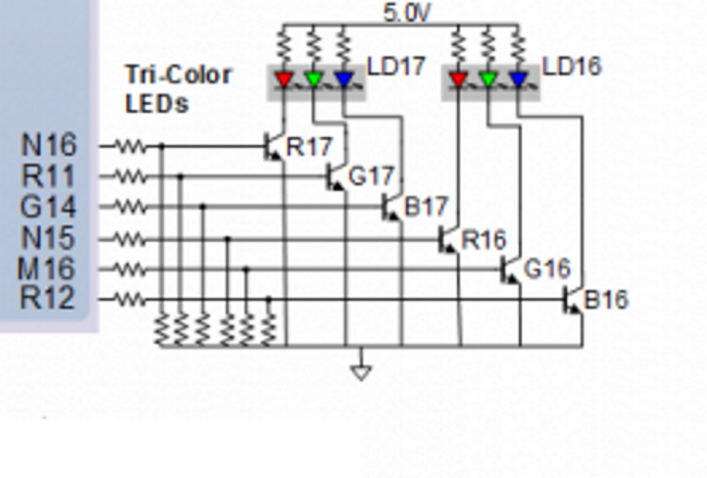
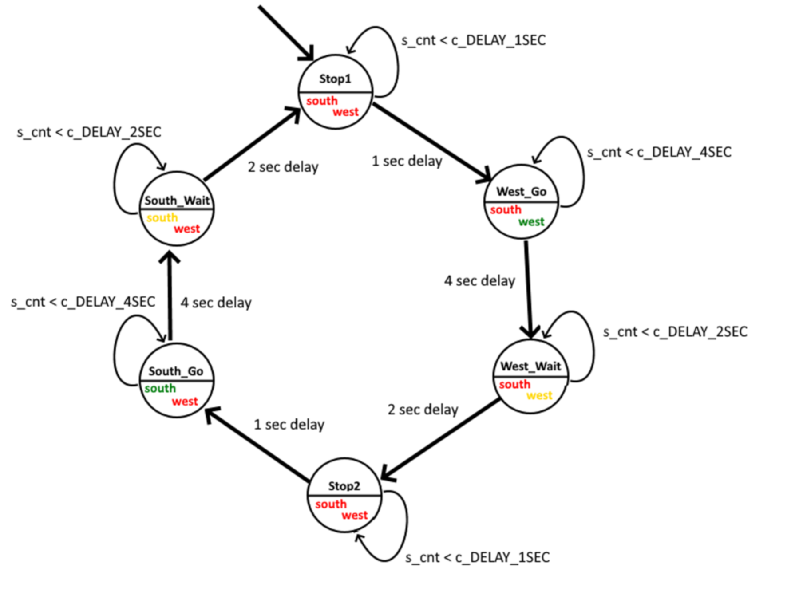
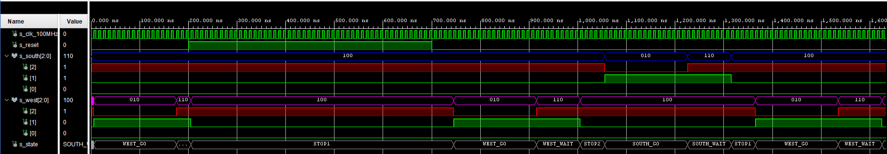
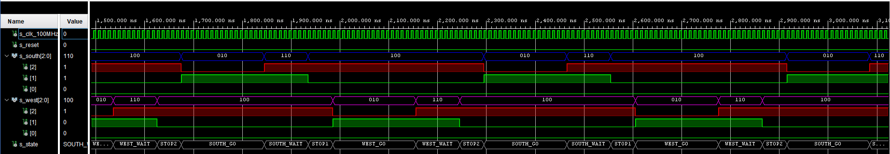
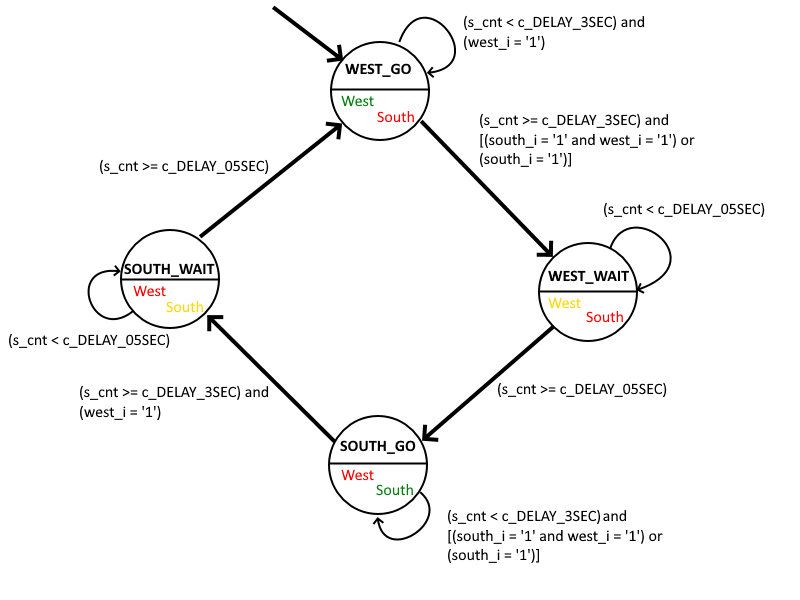

#08-traffic_lights

## Content
- [**1. Preparation tasks**](https://github.com/xhruby28/Digital-electronics-1/tree/main/Labs/08-traffic_lights#1-preparation-tasks)
    - [State table](https://github.com/xhruby28/Digital-electronics-1/tree/main/Labs/08-traffic_lights#state-table-up) 
    - [Figure with connection of RGB LEDs on Nexys A7 board](https://github.com/xhruby28/Digital-electronics-1/tree/main/Labs/08-traffic_lights#figure-with-connection-of-rgb-leds-on-nexys-a7-board-up)
    - [Table with color settings](https://github.com/xhruby28/Digital-electronics-1/tree/main/Labs/08-traffic_lights#table-with-color-settings-up)
- [**2. Traffic light controller**](https://github.com/xhruby28/Digital-electronics-1/tree/main/Labs/08-traffic_lights#2-traffic-light-controller) 
    - [State diagram](https://github.com/xhruby28/Digital-electronics-1/tree/main/Labs/08-traffic_lights#state-diagram-up)
    - [HDL code of sequential process `p_traffic_fsm`](https://github.com/xhruby28/Digital-electronics-1/tree/main/Labs/08-traffic_lights#vhdl-code-of-sequential-process-p_traffic_fsm-up)
    - [VHDL code of combinatorial process `p_output_fsm`](https://github.com/xhruby28/Digital-electronics-1/tree/main/Labs/08-traffic_lights#vhdl-code-of-combinatorial-process-p_output_fsm-up) 
    - [Simulation screenshots](https://github.com/xhruby28/Digital-electronics-1/tree/main/Labs/08-traffic_lights#simulation-screenshots-up)  
- [**3. Flip-flops**](https://github.com/xhruby28/Digital-electronics-1/tree/main/Labs/08-traffic_lights#3-smart-controller)
    - [State table](https://github.com/xhruby28/Digital-electronics-1/tree/main/Labs/08-traffic_lights#state-table-up-1)
    - [State diagram](https://github.com/xhruby28/Digital-electronics-1/tree/main/Labs/08-traffic_lights#state-diagram-up-1)
    - [VHDL code of sequential process `p_smart_traffic_fsm`](https://github.com/xhruby28/Digital-electronics-1/tree/main/Labs/08-traffic_lights#vhdl-code-of-sequential-process-p_smart_traffic_fsm-up)

## 1. Preparation tasks

### State table [UP](https://github.com/xhruby28/Digital-electronics-1/tree/main/Labs/08-traffic_lights#content)

| **Input P** | `0` | `0` | `1` | `1` | `0` | `1` | `0` | `1` | `1` | `1` | `1` | `0` | `0` | `1` | `1` | `1` |
| :-- | :-: | :-: | :-: | :-: | :-: | :-: | :-: | :-: | :-: | :-: | :-: | :-: | :-: | :-: | :-: | :-: |
| **Clock** |  |  |  |  |  |  |  |  |  |  |  |  |  |  |  |  |
| **State** | A | A | B | C | C | D | A | B | C | D | B | B | B | C | D | B |
| **Output R** | `0` | `0` | `0` | `0` | `0` | `1` | `0` | `0` | `0` | `1` | `0` | `0` | `0` | `0` | `1` | `0` |

### Figure with connection of RGB LEDs on Nexys A7 board [UP](https://github.com/xhruby28/Digital-electronics-1/tree/main/Labs/08-traffic_lights#content)



### Table with color settings [UP](https://github.com/xhruby28/Digital-electronics-1/tree/main/Labs/08-traffic_lights#content)

| **RGB LED** | **Artix-7 pin names** | **Red** | **Yellow** | **Green** |
| :-: | :-: | :-: | :-: | :-: |
| LD16 | N15, M16, R12 | `1,0,0` | `1,1,0` | `0,1,0` |
| LD17 | N16, R11, G14 | `1,0,0` | `1,1,0` | `0,1,0` |

## 2. Traffic light controller

### State diagram [UP](https://github.com/xhruby28/Digital-electronics-1/tree/main/Labs/08-traffic_lights#content)



### VHDL code of sequential process `p_traffic_fsm` [UP](https://github.com/xhruby28/Digital-electronics-1/tree/main/Labs/08-traffic_lights#content)

```vhdl
p_traffic_fsm : process(clk)
begin
    if rising_edge(clk) then
        if (reset = '1') then       -- Synchronous reset
            s_state <= STOP1 ;      -- Set initial state
            s_cnt   <= c_ZERO;      -- Clear all bits

        elsif (s_en = '1') then
            -- Every 250 ms, CASE checks the value of the s_state 
            -- variable and changes to the next state according 
            -- to the delay value.
            case s_state is

                -- If the current state is STOP1, then wait 1 sec
                -- and move to the next GO_WAIT state.
                when STOP1 =>
                    -- Count up to c_DELAY_1SEC
                    if (s_cnt < c_DELAY_1SEC) then
                        s_cnt <= s_cnt + 1;
                    else
                        -- Move to the next state
                        s_state <= WEST_GO;
                        -- Reset local counter value
                        s_cnt   <= c_ZERO;
                    end if;

                when WEST_GO =>
                    -- Count up to c_DELAY_4SEC
                    if (s_cnt < c_DELAY_4SEC) then
                        s_cnt <= s_cnt + 1;
                    else
                        -- Move to the next state
                        s_state <= WEST_WAIT;
                        -- Reset local counter value
                        s_cnt   <= c_ZERO;
                    end if;
                    
                when WEST_WAIT =>
                    -- Count up to c_DELAY_2SEC
                    if (s_cnt < c_DELAY_2SEC) then
                        s_cnt <= s_cnt + 1;
                    else
                        -- Move to the next state
                        s_state <= STOP2;
                        -- Reset local counter value
                        s_cnt   <= c_ZERO;
                    end if;
                    
                    
                    when STOP2 =>
                    -- Count up to c_DELAY_1SEC
                    if (s_cnt < c_DELAY_1SEC) then
                        s_cnt <= s_cnt + 1;
                    else
                        -- Move to the next state
                        s_state <= SOUTH_GO;
                        -- Reset local counter value
                        s_cnt   <= c_ZERO;
                    end if;

                when SOUTH_GO =>
                    -- Count up to c_DELAY_4SEC
                    if (s_cnt < c_DELAY_4SEC) then
                        s_cnt <= s_cnt + 1;
                    else
                        -- Move to the next state
                        s_state <= SOUTH_WAIT;
                        -- Reset local counter value
                        s_cnt   <= c_ZERO;
                    end if;
                    
                when SOUTH_WAIT =>
                    -- Count up to c_DELAY_2SEC
                    if (s_cnt < c_DELAY_2SEC) then
                        s_cnt <= s_cnt + 1;
                    else
                        -- Move to the next state
                        s_state <= STOP1;
                        -- Reset local counter value
                        s_cnt   <= c_ZERO;
                    end if;

                -- It is a good programming practice to use the 
                -- OTHERS clause, even if all CASE choices have 
                -- been made. 
                when others =>
                    s_state <= STOP1;

            end case;
        end if; -- Synchronous reset
    end if; -- Rising edge
end process p_traffic_fsm;
```

### VHDL code of combinatorial process `p_output_fsm` [UP](https://github.com/xhruby28/Digital-electronics-1/tree/main/Labs/08-traffic_lights#content)

```vhdl
p_output_fsm : process(s_state)
begin
    case s_state is
        when STOP1 =>
            south_o <= "100";   -- Red (RGB = 100)
            west_o  <= "100";   -- Red (RGB = 100)
            
        when WEST_GO =>
            south_o <= "100";   -- Red   (RGB = 100)
            west_o  <= "010";   -- Green (RGB = 010)
            
        when WEST_WAIT =>
            south_o <= "100";   -- Red    (RGB = 100)
            west_o  <= "110";   -- Yellow (RGB = 110)
            
        when STOP2 =>
            south_o <= "100";   -- Red (RGB = 100)
            west_o  <= "100";   -- Red (RGB = 100)
            
        when SOUTH_GO =>
            south_o <= "010";   -- Green (RGB = 010)
            west_o  <= "100";   -- Red   (RGB = 100)
            
        when SOUTH_WAIT =>
            south_o <= "110";   -- Yellow (RGB = 110)
            west_o  <= "100";   -- Red    (RGB = 100)
            
        when others =>
            south_o <= "100";   -- Red
            west_o  <= "100";   -- Red
    end case;
end process p_output_fsm;
```

### Simulation screenshots [UP](https://github.com/xhruby28/Digital-electronics-1/tree/main/Labs/08-traffic_lights#content)





## 3. Smart controller

### State table [UP](https://github.com/xhruby28/Digital-electronics-1/tree/main/Labs/08-traffic_lights#content)

| **State** | **Lights west** | **Lights south** | **Delay** | | **Cars from both directions** | **Car from north** | **Car from east** | **No cars** |
| :-: | :-: | :-: | :-: | :-: | :-: | :-: | :-: | :-: |
| `WEST_GO` | Green | Red | min 3 sec | | `WEST_WAIT` | `WEST_WAIT` | `WEST_GO` | `WEST_GO` |
| `WEST_WAIT` | Yellow | Red | 0,5 sec | | `SOUTH_GO` | `SOUTH_GO` | `SOUTH_GO` | `SOUTH_GO` |
| `SOUTH_GO` | Red | Green | min 3 sec | | `SOUTH_GO` | `SOUTH_GO` | `WEST_GO` | `SOUTH_GO` |
| `SOUTH_WAIT` | Red | Yellow | 0,5 sec | | `WEST_GO` | `WEST_GO` | `WEST_GO` | `WEST_GO` |

### State diagram [UP](https://github.com/xhruby28/Digital-electronics-1/tree/main/Labs/08-traffic_lights#content)



### VHDL code of sequential process `p_smart_traffic_fsm` [UP](https://github.com/xhruby28/Digital-electronics-1/tree/main/Labs/08-traffic_lights#content)

```vhdl
p_smart_traffic_fsm : process(clk)
begin
    if rising_edge(clk) then                                      
        if (reset = '1') then       -- Synchronous reset          
            s_state <= WEST_GO ;    -- Set initial state          
            s_cnt   <= c_ZERO;      -- Clear all bits             
                                                                  
        elsif (s_en = '1') then                                                                   
            case s_state is
                when WEST_GO =>
                    if (s_cnt < c_DELAY_3SEC) then
                        s_cnt <= s_cnt + 1;
                    elsif (south_i = '1' and west_i = '1') then
                        -- Priority from the right 
                        s_state <= WEST_WAIT;
                        s_cnt   <= c_ZERO;
                    elsif (south_i = '1') then
                        s_state <= WEST_WAIT;
                        s_cnt   <= c_ZERO;
                    elsif (west_i = '1') then
                        s_state <= WEST_GO;
                        s_cnt   <= c_ZERO;
                    end if;
                    
                when WEST_WAIT =>
                    if (s_cnt < c_DELAY_05SEC) then
                        s_cnt <= s_cnt + 1;
                    else
                        s_state <= SOUTH_GO;
                        s_cnt   <= c_ZERO;
                    end if;
                    
                when SOUTH_GO =>
                    if (s_cnt < c_DELAY_3SEC) then
                        s_cnt <= s_cnt + 1;
                    elsif (south_i = '1' and west_i = '1') then
                        -- Priority from the right 
                        s_state <= SOUTH_GO;
                        s_cnt   <= c_ZERO;
                    elsif (south_i = '1') then
                        s_state <= SOUTH_GO;
                        s_cnt   <= c_ZERO;
                    elsif (west_i = '1') then
                        s_state <= SOUTH_WAIT;
                        s_cnt   <= c_ZERO;
                    end if;
                    
                when SOUTH_WAIT =>
                    if (s_cnt < c_DELAY_05SEC) then
                        s_cnt <= s_cnt + 1;
                    else
                        s_state <= WEST_GO;
                        s_cnt   <= c_ZERO;
                    end if;
                                        
                when others =>
                    s_state <= SOUTH_GO;
                    
            end case;                   
        end if; -- Synchronous reset    
    end if; -- Rising edge                        
end process p_smart_traffic_fsm;
```